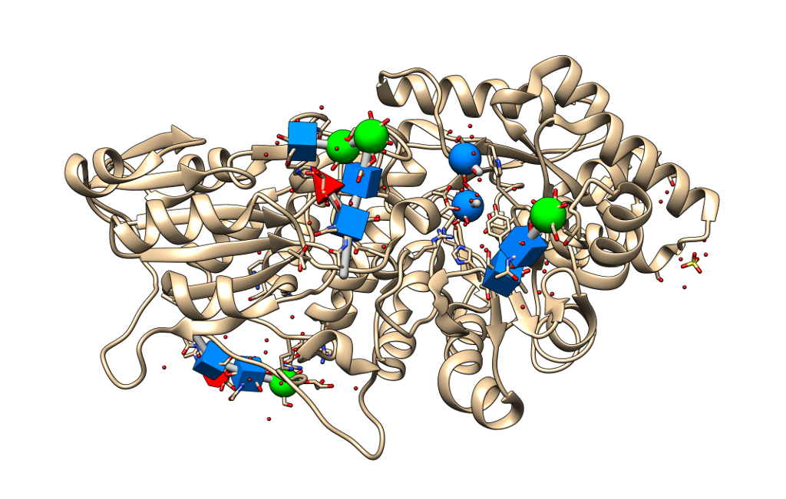

============
Tangram SNFG
============

.. image:: https://img.shields.io/github/release/insilichem/tangram_snfg.svg
    :target: https://github.com/insilichem/tangram_snfg

.. image:: https://img.shields.io/github/issues/insilichem/tangram_snfg.svg
    :target: https://github.com/insilichem/tangram_snfg/issues

Enable easy visualization of saccharydic residues.

Features
========

`SNFG (Symbol Nomenclature for Glycans) <https://doi.org/10.1093/glycob/cwv091>`_ is a visual language that uses colored symbols to represent mono- and oligosaccharides. It was conceived as a 2D language, but it was converted to 3D for VMD in this `publication <https://doi.org/10.1093/glycob/cww076>`_, on which this extension is based.

Usage
=====

The extension provides a new command ``snfg``, which enables the SNFG representation on the currently opened models. If new models are opened, ``snfg`` must be run again for updates to happen. Similarly, ``~snfg`` will disable all currently displayed representations.

The command also admits some optional arguments:

::

    snfg method [simple|full|fullred] spec <selection> size <radius>

- ``method``: change the default representation to one of...
    - ``icon`` (default): small 3D symbols are fit inside the saccharide ring.
    - ``full``: big 3D symbols cover the saccharide ring, and wide cylinders connects. The original representation is hidden.
    - ``fullred``: like *full*, but white caps are used to signal reducing ends.
    - ``fullshown``: like *full*, but the original representation of the residue is not hidden.
- ``spec``: any valid Chimera selection string which will restrict the models to process.
- ``size``: radius of the polyhedron. Defaults to 4.0A in ``full*`` methods and 1.6A in ``icon``.

A small GUI is provided to configure the default values of the 3D symbols and some geometric parameters.

Requirements
============

- ``libtangram``

.. note::

    conda install -c insilichem tangram_snfg

Acknowledgements
================

This particular implementation of the SNFG nomenclature is a straight forward adaptation of the original 3D-SNFG TCL code (3D-SNFG.tcl_, by David F. Thieker and Jodi A. Hadden. Related publication:

::

    3D Implementation of the Symbol Nomenclature for Graphical Representation of Glycans
    D.F. Thieker, J.A. Hadden, K. Schulten, and R.J. Woods
    Glycobiology, 2016

.. _3D-SNFG.tcl: http://glycam.org/3d-snfg